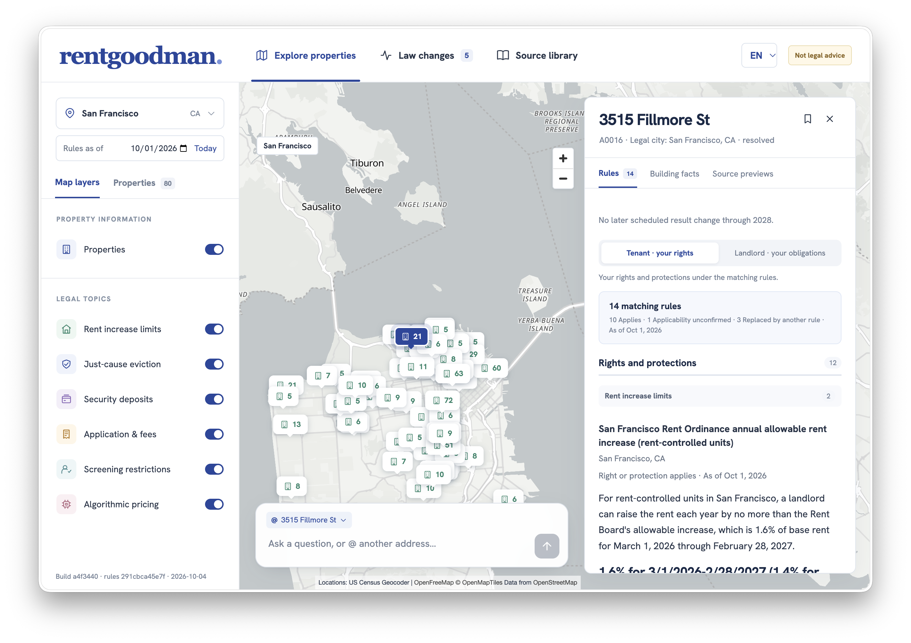

# rentgoodman

**Which rules apply here today, and what is about to change?**

rentgoodman is our entry to the **Rental Housing Law Navigator** challenge (Challenge 02, 7th Global AI Hackathon, Hack-Nation × RealPage, October 2026). It reads public housing law and gives address-level answers with citations, dated lookups and an AI chat that can only say what the sources say.

> **Not legal advice.** rentgoodman shows what the captured source text says, as of a stated date. It is not legal advice or a compliance certification, and its rules have not been reviewed by counsel. Check the cited source and consult a lawyer before acting on any answer.

**Output files:** [`out/rules.json`](out/rules.json) · [`out/lookups.json`](out/lookups.json) · [`out/changes.json`](out/changes.json)

Give it one of 500 rental properties in 9 cities across California, Massachusetts and New Jersey, plus a date. It tells you which rental housing rules apply in the six challenge categories: rent increase limits, just-cause eviction, security deposits, application and screening fees, screening restrictions and algorithmic rent setting. Every answer links back to an exact quote from the law it relies on, along with the date that source was retrieved. If the building data cannot settle a question, the answer is `unknown`, along with the missing fact. It never guesses.



- [What it does](#what-it-does)
- [Challenge requirements](#challenge-requirements)
- [Scores](#scores)
- [Current numbers](#current-numbers)
- [Responsible design](#responsible-design)
- [Scalability path](#scalability-path)
- [Quick start](#quick-start)
- [How it works](#how-it-works)
- [Outputs](#outputs)
- [Verdicts](#verdicts)
- [Change tests](#change-tests)
- [Web app and chat](#web-app-and-chat)
- [HTTP API](#http-api)
- [Rebuilding everything (`run.sh`)](#rebuilding-everything-runsh)
- [Adding a new law (T6)](#adding-a-new-law-t6)
- [Testing and checks](#testing-and-checks)
- [Deploying to Vercel](#deploying-to-vercel)
- [Repository layout](#repository-layout)
- [Known gaps](#known-gaps)
- [License](#license)

## What it does

1. **Extracts rules from the law.** An LLM pipeline reads the source corpus (statutes, ordinances, bills and agency pages) and writes one structured rule record per legal requirement. Each record includes a `quoted_span` that must appear verbatim in its source document. Model responses are cached in the repo, so `out/rules.json` can be rebuilt byte for byte offline.
2. **Resolves each address to its real jurisdiction.** Addresses are geocoded with the US Census geocoder and matched against Census TIGER place boundaries. That way the legal city is the municipality the building actually sits in, not the city in its postal address. Building facts (year built, unit count, use code) come from public parcel datasets.
3. **Evaluates every rule against every building on a given date.** The deterministic engine applies coverage conditions, exemptions, effective and sunset dates, precedence between state and local law, and preemption. Each answer is `applies`, `unknown`, `not_yet_effective`, `pending` or `superseded`, with a plain-language explanation.
4. **Audits itself.** An independent checker recomputes the results at several dates and reports any answer that contradicts the rules.
5. **Shows it on a map.** A static web app lets you browse properties, change the date, read source passages and ask questions in English or Spanish.

## Challenge requirements

### Submission

| Deliverable | Where |
|---|---|
| `rules.json`: rule records in the provided format, with citation and quoted source text | [`out/rules.json`](out/rules.json): 68 rules plus evidence-backed `no_rule_findings`; schema in `starter pack/schema/rule_record.schema.json` |
| `lookups.json`: each rule's result for all 500 addresses (`applies`, `unknown`, `superseded`, `not_yet_effective` or `pending`) | [`out/lookups.json`](out/lookups.json), as of 2026-10-01; reasons and missing facts in `out/lookups_detail.json` |
| `changes.json`: affected addresses and conflict flags for each test | [`out/changes.json`](out/changes.json): T1 to T5 (T6 is added by [`engine.ingest_new`](#adding-a-new-law-t6)) |
| Code and a README explaining how to run it | This repository; see [Quick start](#quick-start) and [Rebuilding everything](#rebuilding-everything-runsh) |
| Live demo | The web app in `mockup/`, deployed to Vercel; see [Deploying to Vercel](#deploying-to-vercel) |

### Modules

| Module | Requirement | How rentgoodman meets it |
|---|---|---|
| A. Rule extraction (required) | Automated, not hand-coded: one record per rule with category, jurisdiction, requirement, coverage conditions, exemptions, effective date, status, penalty, citation and quoted span | LLM pipeline in [`extraction/`](#1-extraction-extraction). Every `quoted_span` is checked to be verbatim in its source, and the run is reproducible offline from the committed model cache |
| B. Address lookup (required) | Jurisdiction stack and every applicable rule; say when a local rule overrides a state rule; say `unknown` instead of guessing | [`buildings/`](#2-buildings-buildings) resolves state, county and legal city from Census TIGER boundaries. The [`engine/`](#3-engine-engine) answers `superseded` with the overriding rule named in the explanation, and `unknown` with the missing fact |
| C. Change tracking (required) | Run the change tests, list affected addresses and the before/after rule set, and support "as of date" queries | [`engine/changes.py`](#change-tests) for T1 to T5, [`engine.ingest_new`](#adding-a-new-law-t6) for T6. Any date is available through `engine.run --as-of`, the [HTTP API](#http-api) and the date picker in the web app |
| Stretch: plain language in English and Spanish | Renter-facing view | Web app and chat in both languages, with tenant and landlord views of each rule |
| Stretch: confidence score and conflict flag | Per answer | Each rule has a `confidence`; each lookup answer carries `conflict_flag` |
| Stretch: one new jurisdiction live | Extend during the event | `engine.ingest_new` extracts, verifies and evaluates a new ordinance in one command |

The 6 rule categories and the change tests are defined by the starter pack (`starter pack/schema/`, `starter pack/dev/change_tests.json`). The scope is 3 states and 10 cities: Los Angeles, San Francisco, San Diego, Berkeley and Santa Ana (CA); Jersey City, Hoboken and Newark (NJ); Boston and Cambridge (MA). Santa Ana laws are extracted, but the address sample has no Santa Ana properties.

## Scores

**Dev-set score:** the scoring script (`score.py`) and dev answer key come with the starter pack and are not in this repository. Run `score.py` against `out/rules.json`, `out/lookups.json` and `out/changes.json` to reproduce the score.

**Change tests T1 to T6:**

| Test | What a correct system does | Result |
|---|---|---|
| T1 · CA AB 325 / SB 763, effective 1/1/2026 | "Not yet effective" for CA addresses on 12/31/2025; "applies" on 1/2/2026 | 250 CA addresses flip from `not_yet_effective` to `applies` |
| T2 · Hoboken and Jersey City local bans | Each ban only inside its own city limits; neither in Newark | Hoboken 40, Jersey City 50, Newark 0; no ban leaks outside its city |
| T3 · NJ FAIR Act, effective 7/1/2027 | "Not yet effective" today, "applies" on 7/2/2027; flags a possible conflict with the local bans | 140 NJ addresses flip; 90 Jersey City and Hoboken addresses flagged for review |
| T4 · MA S.2983 and H.5222 (pending) | Reported as pending, never in force; lists the addresses they would affect | `pending` for every Boston and Cambridge address; 110 would be affected if enacted |
| T5 · MA rent-control ballot question, struck 6/23/2026 | No rent cap for Boston or Cambridge; empty affected set | Recorded as `failed` and omitted from every lookup; affected set is empty |
| T6 · Hour-16 fictional Cambridge ordinance | Extracted unaided, affected addresses listed, future effective date right | `python -m engine.ingest_new` extracts the ordinance, verifies its quotes, evaluates it before and after its effective date and writes the `T6` entry to `out/changes.json`. `scripts/rehearse_t6.py` runs the same command end to end on a stand-in ordinance and checks the result |

The submission self-check (`python -m extraction.selfcheck`, report in `out/selfcheck_report.md`) also tests the schema, verbatim quotes, the output templates, jurisdiction boundaries and the challenge's San Francisco example. Its latest result is in the [checks table](#testing-and-checks).

## Current numbers

This block is regenerated by `scripts/update_readme_numbers.py` on every `run.sh` run (step 5).

<a id='numbers-start'></a>
Generated by `scripts/update_readme_numbers.py` from `out/` (rules sha256 `291cbca4…`, as of 2026-10-01).

| Item | Value |
|---|---|
| Buildings | 500 (487 resolved, 8 resolved_by_source_dataset, 4 resolved_by_mod_iv_municipality, 1 postal_fallback) |
| Rules | 68 total, 68 evaluated, 0 excluded |
| Failed rules | 3 |
| Verdicts on 2026-10-01 | 4,790 applies · 705 unknown · 393 superseded · 220 pending · 140 not_yet_effective |
| Unknown verdicts | before 4,574 (baseline) -> now 705 |

| Test | Affected | Conflict flags | Notes |
|---|---|---|---|
| T1 | 250 | 0 | Mapping: CA-ALG-01 maps to r-0034. Affected = addresses whose mapped rule goes from not_yet_effective on 2025-12-31 to applies on 2026-01-02: 250 (by state: {'CA': 250}). Verdict pairs per (address, rule): not_yet_effective -> applies: 250; omitted -> omitted: 250. |
| T2 | 90 | 0 | Mapping: HOB-ALG-01 maps to r-0161; JC-ALG-01 maps to r-0146. Affected = addresses where a mapped local rule's result is applies inside that rule's jurisdiction on 2026-10-01: Hoboken, NJ 40, Jersey City, NJ 50. Unknown (not counted): none. Results per city: Hoboken, NJ applies 40, Jersey City, NJ applies 50. Checked that every mapped local-rule hit stays inside its declared jurisdiction. |
| T3 | 140 | 90 | Mapping: NJ-ALG-01 maps to r-0173. Compared results on 2026-10-01 and 2027-07-02; affected = not_yet_effective -> applies: 140 addresses (verdict pairs: not_yet_effective -> applies: 140; omitted -> omitted: 360). On 2027-07-02, 90 addresses carry a conflict flag on a mapped rule or a rule declared in conflict_with (JC-ALG-01, HOB-ALG-01), for human review of possible preemption. |
| T4 | 110 | 0 | Mapping: MA-ALG-P1 maps to r-0076, r-0077; MA-ALG-P2 maps to r-0076, r-0077. Simulated enactment (status in force, effective 2026-10-01); 110 addresses would be covered. With the real rules on 2026-10-01, every one of these addresses reports the bills as pending, not in force. |
| T5 | 0 | 0 | Mapping: MA-RENT-P1 maps to r-0148. r-0148 status failed; a failed rule is omitted from every lookup. Checked only petition 25-21; unrelated present or future rent laws do not belong to this guard. |

**Value of information** (out/voi.json): the missing facts that would resolve the most unknown answers.

| Missing fact | City | Unknown answers | Buildings | Rules |
|---|---|---|---|---|
| year_built / certificate_of_occupancy_date | San Diego, CA | 148 | 50 | 3 |
| program or affordable-housing eligibility | San Francisco, CA | 80 | 80 | 1 |
| year_built / certificate_of_occupancy_date | Berkeley, CA | 80 | 40 | 2 |
| program or affordable-housing eligibility | Boston, MA | 60 | 60 | 1 |
| building conversion status | Jersey City, NJ | 50 | 50 | 1 |
| building conversion status | Newark, NJ | 50 | 50 | 1 |
| tenant eligibility and occupancy history | Jersey City, NJ | 50 | 50 | 1 |
| tenant eligibility and occupancy history | Newark, NJ | 50 | 50 | 1 |
| year_built / certificate_of_occupancy_date | Newark, NJ | 48 | 48 | 1 |
| building conversion status | Hoboken, NJ | 40 | 40 | 1 |
<a id='numbers-end'></a>

## Responsible design

The goal is to make the law easier to see, not to issue legal verdicts.

**What the solution should do:**

| Requirement | How rentgoodman does it |
|---|---|
| Cite the source text and retrieval date for every rule | Every rule has `citation`, `source_doc_id`, `source_url` and a verbatim `quoted_span`. The corpus manifests record each document's `retrieved_at` and sha256, and the web app shows "Captured <date>" on every source |
| Show an "as of" date on every answer and separate enacted from pending law | Every lookup is computed for an explicit date, shown on every answer in the web app and chat. Pending bills are answered `pending`, never `applies`; failed measures (such as the struck MA ballot question) are omitted |
| Say "unknown" when coverage depends on missing facts | `unknown` answers name the missing fact. `out/voi.json` ranks which missing facts would resolve the most `unknown`s; see [Known gaps](#known-gaps) |
| Flag conflicts and low-confidence answers for human review | `conflict_flag` on lookup answers (for example, a possible FAIR Act preemption). Rules from secondary sources have confidence capped at 0.6 and go to the review queue |
| Explain rules in plain language a renter can act on | Each rule has `plain_language` text; the web app has tenant and landlord views in English and Spanish |
| Keep an auditable log of sources, model outputs and changes | `out/audit.jsonl` logs every model call (step, model, prompt version, document sha256, cache key, tokens). Raw model responses are committed in `extraction/cache/llm/`, rejected rules in `out/rejected.json`, and `engine.audit` recomputes every answer independently |

**What the solution must not do:**

| Requirement | How rentgoodman avoids it |
|---|---|
| Present output as legal advice or a compliance certification | Every screen shows "Not legal advice"; so does this README |
| Suggest ways to avoid, structure around or evade a rule | The chat only reports rules and facts from the dataset, through three read-only tools. There is no explicit refusal rule for evasion requests yet |
| Invent rules or citations where the source text is silent | Rules whose quote isn't verbatim in the source are rejected. Chat citations that don't match the source text are dropped. "No rule at this level" is recorded as an evidence-backed finding, not inferred from silence |
| Use customer, resident, pricing or other non-public data | Only the starter pack and public sources: Census geocoder, TIGER/Line, county parcel data, and official statute and ordinance text |
| Scrape sites in violation of their terms | Law text comes from the provided corpus and its manifests; building facts come from open-data downloads and APIs |

The engine is deterministic: the same `out/rules.json` and `out/buildings.json` always give the same answers (`engine/tests/test_determinism.py`). An LLM extracts rules, turns coverage text into testable conditions and phrases chat answers. Its outputs are cached and checked against the source text, and the verdict itself is computed by code.

## Scalability path

Adding a jurisdiction is mostly data, not code:

1. **Law text.** Add documents to a corpus manifest such as `corpus_extra/manifest_extra.csv`, with URL, source type, retrieval date and sha256.
2. **Extraction.** The same pipeline extracts rules for any jurisdiction and category, and verbatim checks and review apply automatically. Model responses are cached by content hash, so only new documents cost API calls. `engine.ingest_new` does this for a single ordinance in one command.
3. **Addresses.** The Census geocoder and TIGER place boundaries cover the whole US. A new state needs a parcel-data adapter in `buildings/enrich.py` for year built and unit counts; until then those facts are missing and the affected answers are `unknown`, not wrong.
4. **Coverage conditions.** `engine/classify_conditions.py` turns each rule's coverage text into testable conditions on building facts (unit counts, building age, owner type, …), and checks that each condition is quoted verbatim. Results are cached in `engine/cache/conditions.json`. A new kind of building fact needs support in `engine/conditions.py`; everything else is reused.
5. **Precedence.** State vs. local precedence follows from each rule's `level`, `interaction` and `overrides` fields.

The current corpus already mixes three states with very different structures: state-only rules, layered local rules, a state bar on local rent control, and pending and failed measures.

## Quick start

### Just run the web app

The built app and its data are committed in `mockup/dist/`, so you only need Node 24 and Python 3.12 (Python serves dated lookups):

```sh
cp .env.example .env.local      # optional: add ANTHROPIC_API_KEY to enable chat
npm run build                   # checks the packaged data and writes version.json
npm run dev                     # http://127.0.0.1:4173
```

Without an API key, everything except chat works.

### Full development environment

The full pipeline needs Python 3.12, Node 24 and [uv](https://docs.astral.sh/uv/). Python dependencies are listed in `pyproject.toml` and pinned in `uv.lock`:

```sh
uv sync                                   # creates .venv with all dependencies, including pytest
source .venv/bin/activate
export PYTHONPATH="$PWD/extraction/src"   # lets the engine import the extraction package
```

The extraction package has its own uv project in `extraction/`.

### Environment variables

| Variable | Used by | Purpose |
|---|---|---|
| `ANTHROPIC_API_KEY` | chat, extraction, T6 ingestion | Claude API key. Read from the environment or `.env.local`. |
| `PARCEL_CHAT_MODEL` | chat | Chat model; default `claude-sonnet-5-5`. |
| `VERCEL_AUTOMATION_BYPASS_SECRET` | Vercel | Lets the chat function call the lookup function on protected preview deployments. |
| `PARCEL_PYTHON` | local server | Python binary used for dated lookups; default `python3`. |
| `PARCEL_ENV_FILE` | local server | Extra env file to read the chat config from. |
| `PORT`, `HOST` | local server | Default `4173`, `127.0.0.1`. |
| `PARCEL_BUILD_DATE` | build | Overrides `generated_at` in `version.json`. |

## How it works

```
starter pack/corpus  ─┐
corpus_extra/        ─┴─► extraction/ (LLM + verbatim checks) ─► out/rules.json
                                                                       │
starter pack/data/sample_addresses.csv ─► buildings/ (Census geocoder, │
                                          TIGER places, parcel data) ─► out/buildings.json
                                                                       │
                                                engine/ ◄──────────────┘
                                                   │
                     out/lookups.json, out/lookups_detail.json, out/changes.json, out/voi.json
                                                   │
                                     engine/audit (independent recompute)
                                                   │
                         mockup/scripts/build-data.py ─► mockup/dist/ (web app + chat)
```

### 1. Extraction (`extraction/`)

`extraction/src/extraction/v3/` is the current pipeline:

- `loader.py` loads the provided corpus (`starter pack/corpus/`) and the extra documents (`corpus_extra/`, IDs `DX..`).
- `bm25.py` and `cells.py` find candidate passages per jurisdiction and topic.
- `pipeline.py` asks an extraction model (`claude-sonnet-5-5`) for rule records and a review model (`claude-opus-5-5`) to check them, then normalises citations and computes dates (`dates.py`).
- `verify.py` snaps every `quoted_span` to an exact substring of the source text. Rules whose quote can't be verified are rejected (`out/rejected.json`).
- `no_rule.py` records evidence-backed **"no rule" findings**, such as "local rent control is barred by G.L. c. 40P, § 4". These are listed under `no_rule_findings` in `out/rules.json`.
- `reproduce.py` rebuilds `out/rules.json` from `extraction/cache/llm/` with no network access, and verifies it matches byte for byte.
- `selfcheck.py` runs the submission self-check and writes `out/selfcheck_report.md`.

### 2. Buildings (`buildings/`)

`python -m buildings.run` turns `starter pack/data/sample_addresses.csv` into `out/buildings.json` and `out/buildings_report.md`:

- `geocode.py`: Census batch geocoder. Responses are cached in `buildings/cache/`; pass `--refresh` to re-query.
- `jurisdiction.py` and `places.py`: point-in-polygon against TIGER place boundaries (cached in `buildings/cache/tiger/`). Gives the legal city, plus `city_status` (`resolved`, `postal_fallback`, …) and a confidence.
- `enrich.py` and `facts.py`: year built, unit counts, use codes, a certificate-of-occupancy date range and `missing_facts`, from public parcel sources such as LA County eGIS, SANDAG and NJ MOD-IV.
- `buildings/schema/buildings.schema.json`: the contract for each record.

### 3. Engine (`engine/`)

`python -m engine.run [--as-of YYYY-MM-DD]` is deterministic and makes no network calls:

| Module | Role |
|---|---|
| `prepare.py`, `rules.py` | Load and normalise rules and buildings |
| `conditions.py`, `classify_conditions.py`, `coverage_v3.py` | Turn coverage conditions (unit counts, building age, owner type, …) into testable predicates; cached in `engine/cache/conditions.json` |
| `exemptions.py` | New-construction and other exemptions |
| `temporal.py`, `timeline.py`, `validity.py` | Effective, enacted and sunset dates; prior versions; pending bills |
| `precedence.py` | State vs. local precedence, preemption, conflict flags |
| `verdict.py` | One verdict per (building, rule, date) |
| `explain.py` | Plain-language explanations and `out/lookups_detail.json` |
| `changes.py` | Change tests T1 to T5 → `out/changes.json` |
| `voi.py` | Value of information: which missing facts would resolve the most `unknown`s |
| `audit.py` | Independent re-implementation that checks outputs at any date |
| `parcel_lookup.py` | Single-address, single-date lookup with optional fact overrides (used by the API) |
| `ingest_new.py` | Ingest a new ordinance and list affected addresses (T6) |

`python -m engine.rule_refs` (step 2 of `run.sh`) regenerates the rule cross-references in `engine/rule_refs.json` and `engine/rule_decisions.json`.

### 4. LLM backend (`llm/`)

`llm/backend.py` is a shared wrapper with a disk cache (`.llm_cache/`), concurrency limits and rate-limit backoff. It can call the Anthropic API or the `claude` CLI.

## Outputs

Everything in `out/` is committed and regenerated by `run.sh`:

| File | Contents |
|---|---|
| `rules.json` | Final rule records (schema: `starter pack/schema/rule_record.schema.json`) and `no_rule_findings` |
| `rules_raw.json`, `rejected.json` | Rules before verification and merging; rules rejected by verification |
| `buildings.json`, `buildings_report.md` | One record per address with jurisdiction, facts, `missing_facts` and flags |
| `lookups.json` | Verdicts per address on the default date (submission format) |
| `lookups_detail.json` | The same, with reasons, missing facts and precedence notes |
| `changes.json` | Affected and conflict-flagged addresses for each change test |
| `engine_run.json` | Run metadata: rules sha256, as-of date, verdict counts |
| `voi.json` | Missing facts ranked by how many `unknown`s they would resolve |
| `inferred_omissions.json` | Audit of rules that may be wrongly omitted |
| `links.json` | Rule-to-source links |
| `audit.jsonl`, `audit_metrics.json`, `qa_changes.jsonl` | Audit trail and metrics |

Example `lookups.json` entry:

```json
"A0001": [
  {
    "team_rule_id": "r-0007",
    "result": "applies",
    "explanation": "This rule applies on 2026-10-01; available property facts satisfy its building-level coverage conditions. Review the source for transaction-specific exceptions.",
    "conflict_flag": true
  }
]
```

## Verdicts

| Result | Meaning |
|---|---|
| `applies` | In force on the date, and the building's known facts meet every coverage condition. |
| `unknown` | In force, but a needed fact is missing (unit count, year built, owner type, legal city, …). The explanation names the missing fact. |
| `not_yet_effective` | Enacted, but its effective date is after the as-of date. |
| `pending` | A bill or proposal, not law. |
| `superseded` | In force, but displaced by another rule (for example, a local ordinance preempted by state law). |

`conflict_flag: true` marks answers that need human review, such as a possible preemption that hasn't been resolved.

Rules that don't cover a building (wrong jurisdiction, or clearly exempt) are left out rather than listed as "does not apply".

## Change tests

Defined in `starter pack/dev/change_tests.json`, computed by `engine/changes.py`, written to `out/changes.json`:

| Test | Scenario | Expected |
|---|---|---|
| T1 | California AB 325 / SB 763 (algorithmic rent setting) takes effect | `not_yet_effective` on 2025-12-31, `applies` on 2026-01-02 for CA addresses |
| T2 | Hoboken vs. Jersey City local algorithmic bans | Each city's ban only inside its own boundary; neither in Newark |
| T3 | NJ FAIR Act: enacted, not yet effective, may preempt local bans | `not_yet_effective` on 2026-10-01, `applies` on 2027-07-02; Jersey City and Hoboken flagged for review |
| T4 | Massachusetts pending bills S.2983 and H.5222 | Reported as `pending` for Boston and Cambridge |
| T5 | Massachusetts rent-control ballot question (IP 25-21) struck | No rent cap for any Boston or Cambridge address |

`engine.run` exits with an error if T5 is ever violated.

## Web app and chat

`mockup/` contains the interface:

- `dist/`: static app (`index.html`, `app.js`, `chat.js`, MapLibre GL, Hanken Grotesk font) and packaged data (`data/starter-data.js`, `data/engine-data.js`, source texts under `data/text/`).
- `server.mjs`: local dev server. It serves `dist/` and provides `/api/chat`, `/api/lookup` and `/api/version`.
- `chat-server.mjs`, `chat-tools.mjs`: the chat service. The model gets three read-only tools: `get_building_facts`, `get_rules` and `get_sources`. Answers must cite an exact quote for every legal claim. Citations that can't be verified are dropped. Source documents and history are treated as untrusted data, never as instructions.
- `scripts/build-data.py`, `scripts/check-data.py`: package `out/` into `dist/data/` and verify it (for example, that lookups on 2026-10-01 match `out/lookups.json` exactly).
- `scripts/build-vercel.mjs`: pre-deploy check that the packaged UI and `out/rules.json` agree (via sha256). Also writes `dist/data/version.json`.

Features: map and list of properties, a per-property legal profile, a date picker that recomputes verdicts, "what if" overrides for year built and unit count, a law-changes view showing T1 to T5, source passages with highlighted quotes, and an English/Spanish interface.

## HTTP API

| Endpoint | Description |
|---|---|
| `GET /api/lookup?address=A0001&as_of=2026-10-01[&year_built=1990][&units=4]` | Verdicts for one address on one date, optionally with hypothetical facts. Served by `api/lookup.py` → `engine/parcel_lookup.py`. |
| `POST /api/chat` | Chat turn; streams a structured answer with citations. Served by `api/chat.js`. |
| `GET /api/version` | `{git_sha, rules_sha256, generated_at}` |

Invalid input returns `400` with `{"error": "..."}`. Responses are never cached.

## Rebuilding everything (`run.sh`)

```sh
./run.sh            # rebuild all outputs, audit, test
./run.sh --serve    # same, then start the web app
```

Steps:

1. **Buildings**: `python -m buildings.run`. The first run queries the Census geocoder and downloads TIGER files; later runs use the cache.
2. **Engine**: `engine.rule_refs`, `engine.run`, `engine.voi`.
3. **Audit**: `engine.audit` at 2025-12-31, 2026-01-02 and 2027-07-02, plus `scripts/audit_inferred_omissions.py`.
4. **Web app data**: `build-data.py`, `check-data.py`, `npm run check`.
5. **README numbers**: `scripts/update_readme_numbers.py` fills in the generated blocks in this file.
6. **Tests**: `pytest engine/tests buildings/tests tests` (uses `uv` if pytest isn't installed).
7. Shows which outputs changed.

Rule extraction is **not** part of `run.sh`, because it needs an API key and is slow. To re-run it from the cache, use `PYTHONPATH=extraction/src python -m extraction.v3.reproduce` (add `--write` to replace `out/rules.json`).

## Adding a new law (T6)

```sh
python -m engine.ingest_new path/to/ordinance.txt \
  --jurisdiction "Cambridge, MA" \
  --effective 2027-01-01 \
  [--extractor auto|claude|part1|deterministic] [--dry-run]
```

This extracts rules from the new text, verifies their quotes, evaluates them against all 500 buildings before and after the effective date, and adds a `T6` entry to `out/changes.json`. New rules go to `out/rules_hour16.json` by default. `scripts/rehearse_t6.py` runs an offline end-to-end rehearsal with `engine/fixtures/fake_cambridge_ordinance.txt` and checks the result against `engine/fixtures/t6_rehearsal.json`.

## Testing and checks

```sh
python -m pytest -q engine/tests buildings/tests tests     # engine, buildings, LLM backend
(cd extraction && uv run --with pytest python -m pytest tests -q)   # extraction, model calls mocked
npm test                                                  # web app handlers and chat server (node --test)
npm run check                                             # syntax checks for the JS
PYTHONPATH=extraction/src python -m extraction.selfcheck  # submission self-check
python -m engine.audit --as-of 2026-01-02                 # independent audit at any date
```

The engine tests cover determinism, precedence, temporal logic, exemptions, unit intervals, explanations, contract fields and the change tests. Latest results:

<a id='checks-start'></a>
Generated by `scripts/update_readme_numbers.py` (rules sha256 `291cbca4…`).

| Check | Result |
|---|---|
| Submission self-check (`python -m extraction.selfcheck`, report in `out/selfcheck_report.md`) | 17/17 pass |
| T1: affected addresses, addresses with a conflict flag (`out/changes.json`) | 250 affected, 0 flagged |
| T2: affected addresses, addresses with a conflict flag (`out/changes.json`) | 90 affected, 0 flagged |
| T3: affected addresses, addresses with a conflict flag (`out/changes.json`) | 140 affected, 90 flagged |
| T4: affected addresses, addresses with a conflict flag (`out/changes.json`) | 110 affected, 0 flagged |
| T5: affected addresses, addresses with a conflict flag (`out/changes.json`) | 0 affected, 0 flagged |
| Rules whose `quoted_span` is found verbatim: an exact substring of the raw text of the rule's `source_doc_id` file (same test as the self-check) | 68/68 (100.0%) |
| `applies` answers in `out/lookups.json` (as of 2026-10-01) whose rule's `source_doc_id` is a document of the provided corpus (`starter pack/corpus/corpus_manifest.csv`), not of `corpus_extra/` | 4,649/4,790 (97.1%) |
| `out/rules.json` rebuilt byte for byte offline from the committed cache (`python -m extraction.v3.reproduce`) | no: FAILED (exit 1): incremental extraction failed; no canonical output was written |
| Tests: `engine/tests`, `buildings/tests`, `tests` | 306 passed, 2 skipped |
| Tests: `extraction/tests` (uv project, model calls mocked) | FAILED (exit 1): 7 failed, 86 passed in 1.57s |
| Rules in `out/rules.json` | 68 |
| Evidence-backed "no rule" findings (`no_rule_findings` in `out/rules.json`) | 2 |
<a id='checks-end'></a>

## Deploying to Vercel

1. Import the repository and leave **Root Directory** empty (the repo root). `vercel.json` sets the build command (`npm run build`), the output directory (`mockup/dist`) and the three functions in `api/`.
2. Make sure the project settings don't override **Build Command** or **Output Directory**.
3. Add `ANTHROPIC_API_KEY` (and optionally `PARCEL_CHAT_MODEL` and `VERCEL_AUTOMATION_BYPASS_SECRET`) as environment variables.

`.vercelignore` keeps the pipeline, caches and corpus PDFs out of the upload. Root-only entries there must start with `/` (for example `/scripts`), because a bare name matches at any depth and would also drop `mockup/scripts/`.

## Repository layout

```
api/                 Vercel functions: chat.js, lookup.py, version.js
buildings/           Address → jurisdiction + building facts
corpus_extra/        Extra source documents (DX01…), with manifest_extra.csv
engine/              Deterministic rules engine, audit, T6 ingestion; tests and fixtures
extraction/          LLM rule extraction (uv project); cache/llm holds committed model responses
llm/                 Shared LLM backend with caching and backoff
mockup/              Web app (dist/), dev server, chat service, data packaging scripts
out/                 All generated outputs (committed)
scripts/             README numbers, audits, rehearsals, sha checks
starter pack/        Challenge inputs: corpus, sample addresses, schema, change tests, templates
tests/               LLM backend tests
run.sh               Full rebuild
```

## Known gaps

The engine answers `unknown` instead of guessing. The table below lists the facts the building data lacks and where that matters.

<a id='withheld-start'></a>
Generated by `scripts/update_readme_numbers.py` from `out/rules.json`, `out/lookups.json` and `out/lookups_detail.json` (as of 2026-10-01).

| Case | What the engine does | Rules | Answers on 2026-10-01 |
|---|---|---|---|
| Failed measure (`status: failed`) | Omitted from every lookup on every date (`engine/verdict.py`). | 3: r-0148, r-0155, r-0156 | no lookup entry |
| Pending bill (`status: pending`) | Answered `pending`, never `applies`. | 3: r-0076, r-0077, r-0182 | 220 pending |
| Enacted, effective later | Answered `not_yet_effective` until its effective date. | 1: r-0173 | 140 not_yet_effective |
| Bar on local rent control (G.L. c. 40P): binds cities, not landlords | Never reported as a rent cap. It is listed at Massachusetts addresses as a statewide bar, and its conditions are read as limits on any permitted local regulation (`engine/verdict.py`). The cities it bars carry an evidence-backed "no rule" finding instead of a local cap; the self-check fails if an in-force rule sits in such a cell. | 1: r-0185; "no rule" findings: Boston, MA (rent_increase_limits), Cambridge, MA (rent_increase_limits) | the bar: 110 applies; `applies` in a "no rule" cell: 0 |
| Event-only rule (`event_only: true`: plays only at an event such as a no-fault eviction, a demolition or a conversion) | Never wins a precedence edge, so it cannot supersede another rule (`engine/precedence.py`). Its building answer does not check whether the event occurred. | 7: r-0116, r-0149, r-0164, r-0165, r-0174, r-0184, r-0192 | 420 applies, 140 unknown, 80 superseded |
| State law limited to one city (`applies_only_in`) | Evaluated as a rule of that city: omitted elsewhere in the state, `unknown` where the legal city rests on the postal city (`engine/verdict.py`). | 1: r-0184 | 80 superseded; entries outside the named city: 0 |
| Secondary source (the source document is not `official` in the corpus manifests) | Confidence capped at 0.6 and the answer sent to the review queue, even when the quote is exact (`engine/explain.py`). | 4: r-0029, r-0148, r-0181, r-0182 | 60 unknown; capped and sent to review: 60/60 |
| A fact capable of changing coverage is missing | Answered `unknown`, naming the missing fact, never guessed. | 24 rules with at least one `unknown` answer | 705 unknown |
<a id='withheld-end'></a>

<a id='gaps-start'></a>
Generated by `scripts/update_readme_numbers.py` from `out/rules.json`, `out/lookups_detail.json`, `out/voi.json` and `out/buildings.json` (as of 2026-10-01).

**New-construction exemptions the building data cannot settle** (evidence-backed `coverage.new_construction_exemption`, tested with the engine's own function):

| Rule | Jurisdiction | Exemption | Unknown answers | Why |
|---|---|---|---|---|
| r-0036 | CA | 15 years | 50 | 50 year built missing |
| r-0039 | CA | 15 years | 98 | 98 year built missing |
| r-0162 | Jersey City, NJ | 30 years | 22 | 22 year built missing |
| r-0187 | San Diego, CA | 15 years | 50 | 50 year built missing |
| r-0189 | Hoboken, NJ | 30 years, owner filing required | 40 | 36 year built missing, 4 owner filing not in the data |
| r-0191 | Newark, NJ | 30 years, owner filing required | 48 | 48 year built missing |

**Facts missing from the building data** (`out/voi.json`; one unknown answer can name several facts):

| Missing fact | Unknown answers naming it | Buildings | Cities |
|---|---|---|---|
| year_built / certificate_of_occupancy_date | 370 | 206 | Berkeley, CA; Hoboken, NJ; Jersey City, NJ; Los Angeles, CA; Newark, NJ; San Diego, CA; San Francisco, CA |
| program or affordable-housing eligibility | 140 | 140 | Boston, MA; San Francisco, CA |
| building conversion status | 140 | 140 | Hoboken, NJ; Jersey City, NJ; Newark, NJ |
| tenant eligibility and occupancy history | 140 | 140 | Hoboken, NJ; Jersey City, NJ; Newark, NJ |
| owner type / owner occupancy | 46 | 41 | Berkeley, CA; Hoboken, NJ |
| unit count | 6 | 1 | Hoboken, NJ |
| owner exemption filing | 4 | 4 | Hoboken, NJ |
| legal_city | 4 | 1 | San Diego, CA |
| units | 1 | 1 | Hoboken, NJ |

- Facts named missing per building in `out/buildings.json`: `owner_type` 500/500, `units` 245/500, `year_built` 212/500, `certificate_of_occupancy_date` 212/500.
- Legal city taken from the postal city only (`city_status: postal_fallback`): A0346 (San Diego, CA); city rules there are answered `unknown`: 4 answers.
- Rules whose own notes record that part of their source text was not captured: 17: r-0006, r-0034, r-0069, r-0080, r-0129, r-0146, r-0148, r-0150, r-0151, r-0153, r-0154, r-0158, r-0162, r-0163, r-0165, r-0166, r-0168.
<a id='gaps-end'></a>

This is a research prototype, not legal advice. Check the cited source and consult a lawyer before acting on any answer.

## License

[MIT](LICENSE)
